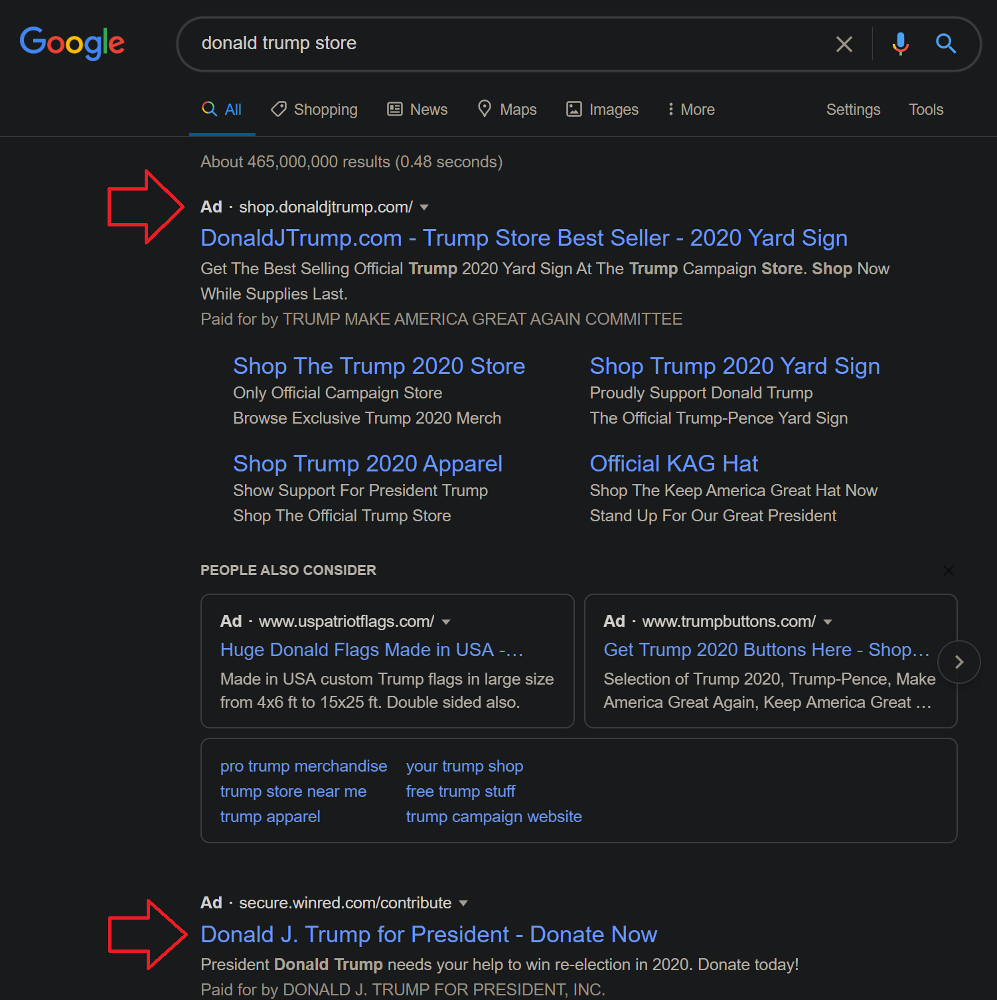
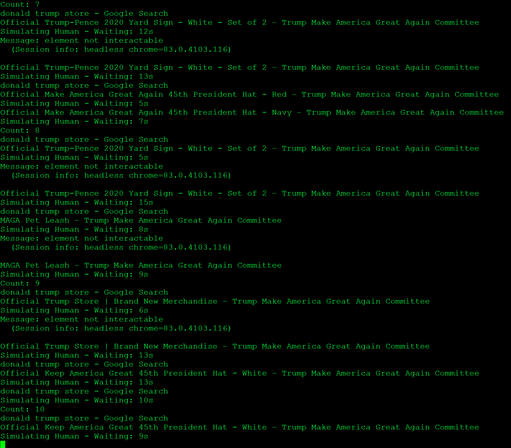

### 2020/07 BuRnCycL

### About

Trump Ads cost money. Script will browse the top two Google Ads in a loop. Thus costing the campaign money.



Based on Google's Documentation, the click is counted as soon as it's received.

```
Counting clicks

When a user clicks on an ad creative, a click request is sent to the Ad Manager ad server. 
Ad Manager counts a click as soon as it receives the click request and then sends the user 
the defined click-through URL. Note that Ad Manager counts the click when it's received, 
not when the user is redirected to the click-through URL.
```

Reference: 
- https://support.google.com/admanager/answer/2521337?hl=en 
- https://support.google.com/admanager/answer/141811#googleAdManagerIABFiltration

Written for Linux systems. But, with some technical skill can be utilized on Mac or Windows.

### Installation
Ubuntu 18.04+

Install using the script
```
sudo ./install.sh
```

### Execution 

Setup Python3 Virtual Environment
```
source ./init.sh
```

Run Script
```
python3 trump.py
```


